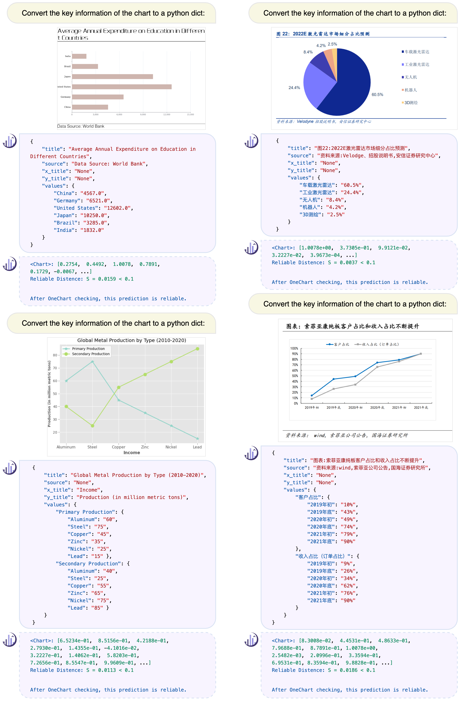

<h3><a href="https://github.com/LingyvKong/OneChart/blob/main/OneChart_paper.pdf">OneChart: Purify the Chart Structural Extraction via One Auxiliary Token</a></h3>
<a href="http://arxiv.org/abs/2404.09987"></a> 
<a href="https://onechartt.github.io/"></a>
<a href='https://huggingface.co/kppkkp/OneChart/tree/main'></a>
<a href="https://zhuanlan.zhihu.com/p/692607557"></a> 

Jinyue Chen*, Lingyu Kong*, [Haoran Wei](https://scholar.google.com/citations?user=J4naK0MAAAAJ&hl=en), Chenglong Liu, [Zheng Ge](https://joker316701882.github.io/), Liang Zhao, [Jianjian Sun](https://scholar.google.com/citations?user=MVZrGkYAAAAJ&hl=en), Chunrui Han, [Xiangyu Zhang](https://scholar.google.com/citations?user=yuB-cfoAAAAJ&hl=en)
	


<p align="center">

</p>

## Release
- [2024/4/21] 🔥🔥🔥 We have released the web demo in [Project Page](https://onechartt.github.io/). Have fun!!
- [2024/4/15] 🔥 We have released the [code](https://github.com/LingyvKong/OneChart), [weights](https://huggingface.co/kppkkp/OneChart/tree/main) and the benchmark [data](https://drive.google.com/drive/folders/1YmOvxq0DfOA9YKoyCZDjpnTIkPNoyegQ?usp=sharing). 


## Contents
- [1. Benchmark Data and Evaluation Tool](#1-benchmark-data-and-evaluation-tool)
- [2. Install](#2-install)
- [3. Demo](#3-demo)
- [4. Train](#4-train)

<p align="center">

</p>

## 1. Benchmark Data and Evaluation Tool
- Download the ChartSE images and jsons [here](https://drive.google.com/drive/folders/1YmOvxq0DfOA9YKoyCZDjpnTIkPNoyegQ?usp=sharing). 
- Modify json path at the beginning of `ChartSE_eval/eval_ChartSE.py`. Then run eval script:
   
```shell
python ChartSE_eval/eval_ChartSE.py
```

## 2. Install
- Clone this repository and navigate to the code folder
```bash
git clone https://github.com/LingyvKong/OneChart.git
cd OneChart/OneChart_code/
```
- Install Package
```Shell
conda create -n onechart python=3.10 -y
conda activate vary
pip install -e .
pip install -r requirements.txt
pip install ninja
pip install flash-attn --no-build-isolation
```
- Download the OneChart weights [here](https://huggingface.co/kppkkp/OneChart/tree/main). 
  
## 3. Demo
```Shell
python vary/demo/run_opt_v1.py  --model-name  /onechart_weights_path/
```
Following the instruction, type `1` first, then type image path.

## 4. Train
- Prepare the dataset and fill in the data path to `OneChart/OneChart_code/vary/utils/constants.py`. Then a example script is:
```shell
deepspeed /data/OneChart_code/vary/train/train_opt.py     --deepspeed /data/OneChart_code/zero_config/zero2.json --model_name_or_path /data/checkpoints/varytiny/  --vision_tower /data/checkpoints/varytiny/ --freeze_vision_tower False --freeze_lm_model False --vision_select_layer -2 --use_im_start_end True --bf16 True --per_device_eval_batch_size 4 --gradient_accumulation_steps 1 --evaluation_strategy "no" --save_strategy "steps" --save_steps 250 --save_total_limit 1 --weight_decay 0. --warmup_ratio 0.03 --lr_scheduler_type "cosine" --logging_steps 1 --tf32 True --model_max_length 2048 --gradient_checkpointing True --dataloader_num_workers 4 --report_to none --per_device_train_batch_size 16 --num_train_epochs 1 --learning_rate 5e-5 --datasets render_chart_en+render_chart_zh  --output_dir /data/checkpoints/onechart-pretrain/
```
- You can pay attention to modifying these parameters according to your needs: `--model_name_or_path`, `freeze_vision_tower`, `--datasets`, `--output_dir` 


## Acknowledgement
- [Vary](https://github.com/Ucas-HaoranWei/Vary): the codebase and initial weights we built upon!

[](https://github.com/tatsu-lab/stanford_alpaca/blob/main/LICENSE)
[](https://github.com/tatsu-lab/stanford_alpaca/blob/main/DATA_LICENSE)

**Usage and License Notices**: The data, code, and checkpoint are intended and licensed for research use only. They are also restricted to use that follow the license agreement of Vary, Opt. 


## Citation
If you find our work useful in your research, please consider citing OneChart:
```bibtex
@misc{chen2024onechart,
      title={OneChart: Purify the Chart Structural Extraction via One Auxiliary Token}, 
      author={Jinyue Chen and Lingyu Kong and Haoran Wei and Chenglong Liu and Zheng Ge and Liang Zhao and Jianjian Sun and Chunrui Han and Xiangyu Zhang},
      year={2024},
      eprint={2404.09987},
      archivePrefix={arXiv},
      primaryClass={cs.CV}
}
```
